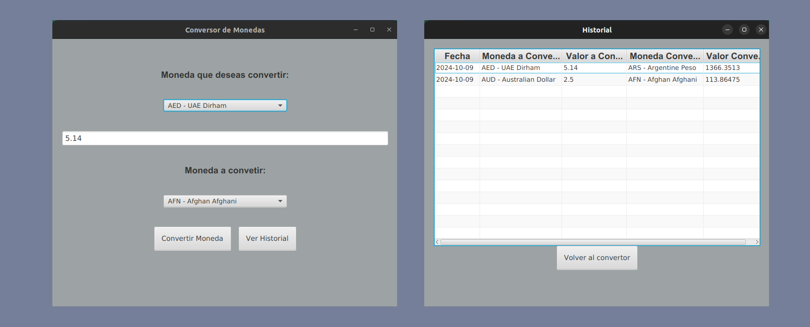

# Convertidor de texto de Texto



## Descripción

Este proyecto es un convertidor de monedas desarrollado como parte del programa Oracle Next Education. Se trabajo para practicar conceptos basicos de Java y POO.


## Tecnologías Utilizadas

- Java
- JavaFX
- RestAPI

## Instalación

1. Clona este repositorio en tu máquina local:
    ```bash
    git clone https://github.com/Juan-Garavito/ConversorMonedas-JavaFx.git
    ```
2. Navega hasta el directorio del proyecto:
    ```bash
    cd ConversorMonedas-JavaFx
    ``` 

## Uso

1. Abre con Intellij o IDE de confianza.
2. Obtener API_KEY de la api Exchangerate Api [https://www.exchangerate-api.com/]
3. Agrega las variables de entorno:
- API_KEY={remplazar_con_key}
- BASE_URL= https://v6.exchangerate-api.com/v6/
3. Ejecutar proyecto desde el IDE.

## Desarrollado por

- **Nombre:** Juan Camilo Lozada Garavito
- **LinkedIn:** https://www.linkedin.com/in/juancamilogaravito/
- **GitHub:** https://github.com/Juan-Garavito


